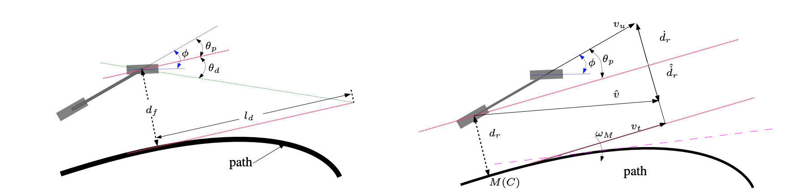

# Implementation

# GSoC'22 RoboComp project: Self-Adaptive controller for path following

## Existing Controller

The current path_follower DSR Component in the Robocomp framework is a Stanley Controller. 

Stanley Controller Law is given by

$$
\phi(t) = \theta_p(t) +  tan^{-1}\left(\frac{k_v d_f(t)}{v}\right)
$$

This controller works to  :

- Compensate Angular Error $\theta_p$ : Steer to align heading with desired heading
- Compensate Front Lateral Distance Error $d_f$ measured from the centre of the front axle to the nearest point on the path.

## Sliding Mode Control

This is a simple and robust control law that has the following advantages :

- It does not need the precise model of the system.
- Ensures Stability even when the system parameters change overtime.
- It reduces the order of the system for control.

This kind of control is designed to drive the system on to sliding surface after which the control law is designed. The sliding surface is designed such that the system in sliding mode evolves in the desired way. The control law is chosen to enforce the selected sliding surface. 

### Selection of Sliding Surface:

The sliding surface for this system is chosen to be

$$
\psi = k_{\theta p}\theta_p + k_dd_r \tag{1}
$$

where $k_{\theta p},k_d$ are weighting coefficients. 

The controller without chattering is given as 

$$
\dot{\psi} = - k_{\psi}\psi \tag{2}
$$

where $k_{\psi}>0$ is a constant.

With respect to the popular Ackerman kinematic model, the steering angle $\phi$  can be computed by 

$$
\phi = atan \left(L \left(\frac{W_1}{v_u} + c(s) \frac{cos(\theta_p)}{1 - c(s)d_r}\right)\right) , v_u \neq 0 \tag{3}
$$

with 

$$
\dot{\theta_p} = W_1 = -\frac{k_{\psi}k_{\theta p}\theta_{p} + k_{\psi}k_d d_r + k_d \dot{d}_r}{k_{\theta_p}} \tag{4}
$$

where $\dot{d}_r = sin(\theta_p)v_u$
The terms are defined as follows : 
- $d_r$ : Rear lateral deviation of vehicle wrt C
- $\phi$ : Steering Angle
- $c(s)$ : Curvature of path C at M
- $v_u$ : Speed of car
- $L$ : Vehicle Wheel Base
- $R$ : Radius of Curvature